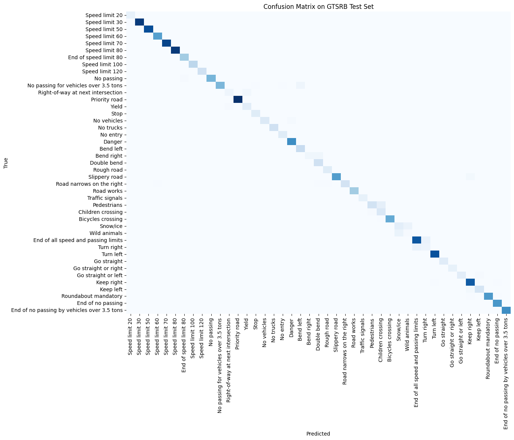

# Real‑Time Traffic Sign Recognition

A deep‑learning project that fine‑tunes a ResNet‑18 to classify 43 German traffic signs, achieving **95.71%** test accuracy. Includes data preprocessing, training scripts, plotting notebooks, and a Streamlit demo for one‑click inference.

## Features

- **Data Prep**: (`scripts/preprocess.py`)
  - Resizes 39,209 training and 12,630 test images to 64×64 
  - Organizes into `data/processed/train/<class_id>/` and `data/processed/test/<class_id>/`  

- **Model**:
  - Fine‑tuned **ResNet‑18** with ImageNet weights  
  - Color jitter, random rotations, affine transforms  
  - final trained weights at `models/traffic_resnet18.pth`
 
- **Training**: (`scripts/train.py`)
  - 10 epochs, Adam optimizer, LR scheduler  
  - Validation split (80/20) to prevent overfitting  

- **Visualization**: (`plots.ipynb`)
  - Loss & accuracy curves   
  - 43×43 confusion matrix heatmap  

- **Demo App**: (`app/demo.py`) 
  - **Streamlit** interface for real‑time prediction from any uploaded image  
  - Displays human‑readable sign names

## Reuslts
- **Final Test Accuracy:** 95.71%  
- **Validation Accuracy:** up to 98.41%  
- **Confusion Matrix:**  
  
  
## To run the app :
```bash
git clone https://github.com/ash9201/traffic‑sign‑recognition.git
cd traffic-sign-recognition
pip install -r requirements.txt
streamlit run app/demo.py
